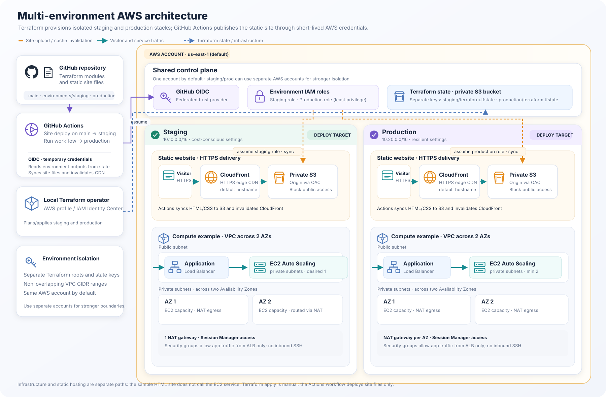

# Multi-environment AWS infrastructure and static site

This repository contains Terraform-managed AWS infrastructure and a small static website. It has no application backend or API. GitHub Actions publishes the HTML/CSS site to AWS after the hosting infrastructure has been created.

## Architecture



Terraform provisions a VPC and sample EC2 service alongside private S3 and CloudFront static hosting in each environment. GitHub Actions uses OIDC roles to deploy the site; it reads Terraform outputs but does not apply infrastructure changes. Staging and production have separate state keys and non-overlapping networks.

## What gets deployed

Each environment has its own Terraform root, VPC, and S3 state key. Staging and production use non-overlapping CIDRs (`10.10.0.0/16` and `10.20.0.0/16`). By default, both target the same AWS account and `us-east-1`; for account-level isolation, use distinct AWS accounts and credentials or roles for the two environments.

The infrastructure includes two web paths:

- **Static site:** `site/` is uploaded to a private S3 bucket. CloudFront serves it over HTTPS using Origin Access Control, so the bucket itself is not public. `static_site_url` is the public URL.
- **Compute example:** a public Application Load Balancer forwards HTTP to EC2 instances in private subnets. The instances use Session Manager rather than inbound SSH. This demonstrates the network, compute, and security-group modules; `service_url` is its sample endpoint.

The two paths are separate examples. The static HTML does not call the EC2 service and there is no API/backend application. CloudFront currently uses its default hostname and certificate; no custom domain, DNS, or application API is configured.

## Terraform modules

- `modules/network` creates the VPC, public/private subnets, internet gateway, route tables, and NAT gateways.
- `modules/security-groups` permits configured HTTP clients to reach the load balancer and permits application traffic only from that load balancer.
- `modules/compute` creates the load balancer, launch template, Auto Scaling group, and Systems Manager instance role.
- `modules/static-site` creates the private S3 origin, CloudFront distribution, cache policy, and origin access policy.
- `modules/environment` composes the modules for each environment.

Staging uses one NAT gateway and one desired EC2 instance to reduce its baseline cost. Production uses NAT per AZ, at least two EC2 instances, and ALB deletion protection. The VPC/compute example and the static hosting resources all incur AWS charges; destroy environments you no longer need.

## Prerequisites

- Terraform 1.10 or later
- AWS CLI and AWS credentials with permissions to create the listed AWS resources
- An S3 state bucket created before Terraform initialization
- A GitHub repository with `staging` and `production` environments configured for Actions

The state bucket is separate from the application buckets. Enable S3 versioning, encryption, and Block Public Access on the state bucket. Terraform uses S3 native lock files (`use_lockfile = true`). See the [Terraform S3 backend documentation](https://developer.hashicorp.com/terraform/language/backend/s3).

## Create the AWS infrastructure

For local development, authenticate with AWS first. AWS IAM Identity Center is a good option when available:

```sh
aws configure sso --profile terraform-dev
aws sso login --profile terraform-dev
export AWS_PROFILE=terraform-dev
aws sts get-caller-identity
```

Copy the environment examples and set the state bucket name and its region in each `backend.hcl`. Update each `terraform.tfvars` with your AWS region and settings. The examples allow public HTTP access to the ALB; restrict `allowed_ingress_cidrs` before using it for a real service.

```sh
cp environments/staging/backend.hcl.example environments/staging/backend.hcl
cp environments/staging/terraform.tfvars.example environments/staging/terraform.tfvars
cp environments/production/backend.hcl.example environments/production/backend.hcl
cp environments/production/terraform.tfvars.example environments/production/terraform.tfvars

terraform -chdir=environments/staging init -backend-config=backend.hcl
terraform -chdir=environments/staging plan
terraform -chdir=environments/staging apply
terraform -chdir=environments/staging output static_site_url

terraform -chdir=environments/production init -backend-config=backend.hcl
terraform -chdir=environments/production plan
terraform -chdir=environments/production apply
terraform -chdir=environments/production output static_site_url
```

Review each plan before applying. The workflow reads the S3 bucket and CloudFront distribution IDs from remote Terraform state, so create each environment at least once before running a site deployment. Terraform infrastructure changes are not applied by the site workflow.

The S3 backend uses a different object key per environment. The backend bucket is a shared prerequisite and is deliberately not created by these stacks, avoiding a state bootstrap cycle. `backend.hcl` and `terraform.tfvars` are ignored by Git; do not commit credentials or Terraform state.

## Configure GitHub Actions and AWS

The workflow is [.github/workflows/deploy-static-site.yml](.github/workflows/deploy-static-site.yml):

- A push to `main` that changes `site/` or the workflow deploys **staging**.
- In GitHub Actions, choose **Deploy static site → Run workflow → production** to deploy production. Protect the GitHub `production` environment with required reviewers so this deployment waits for approval.
- The workflow substitutes the environment name into the page, syncs files to that environment's S3 bucket, invalidates CloudFront, and waits for the invalidation to finish.

Create GitHub Actions environments named `staging` and `production`. Add these **environment variables** to each:

| Variable | Value |
| --- | --- |
| `AWS_ROLE_ARN` | IAM role that this environment's workflow may assume |
| `AWS_REGION` | AWS region containing this environment's stack |
| `TF_STATE_BUCKET` | Shared Terraform state bucket name |
| `TF_STATE_REGION` | Region containing the state bucket |

Configure AWS IAM OIDC federation for `token.actions.githubusercontent.com`, and scope each role's trust policy to this repository and the matching GitHub environment. The workflow only runs from `main`. The workflow uses short-lived OIDC credentials and does not need long-lived AWS access keys in GitHub. The role needs `s3:ListBucket` on the state bucket, read access to that environment's state object, access to its `.tflock` object, `s3:ListBucket` plus `s3:GetObject`, `s3:PutObject`, and `s3:DeleteObject` for that environment's static-site bucket, and CloudFront invalidation permissions for that environment's distribution. Use separate staging and production roles, and keep the production role narrowly scoped. Newer GitHub repositories may use immutable owner/repository IDs in the OIDC `sub` claim; match the trust policy to the claim format GitHub issues for this repository. See [GitHub's AWS OIDC guide](https://docs.github.com/en/actions/how-tos/secure-your-work/security-harden-deployments/oidc-in-aws).

The workflow only deploys the site; it does not create or update VPC, EC2, or CloudFront infrastructure. Apply those changes through Terraform first. After the first successful site deployment, the workflow summary and GitHub Environment show the site's CloudFront URL.

## Change the site

Edit `site/index.html` and `site/styles.css`, then commit and push to `main`. Staging deploys automatically when those paths change. Use the workflow dispatch menu for a production deployment. CloudFront uses a short cache lifetime, and the workflow also invalidates cached files after upload.

## Tear down

Destroy an environment with its matching AWS credentials and backend:

```sh
terraform -chdir=environments/staging destroy
```

For production, first set `enable_deletion_protection = false` in its `terraform.tfvars`, apply that change, then destroy. Keep the shared state bucket; the Terraform environment stacks do not own it.
